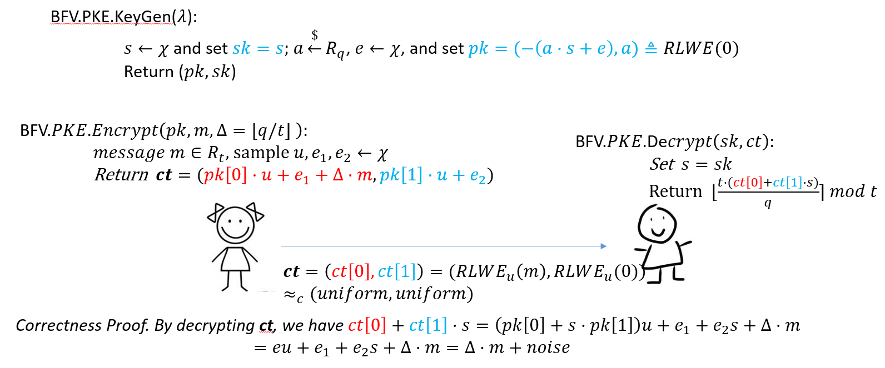
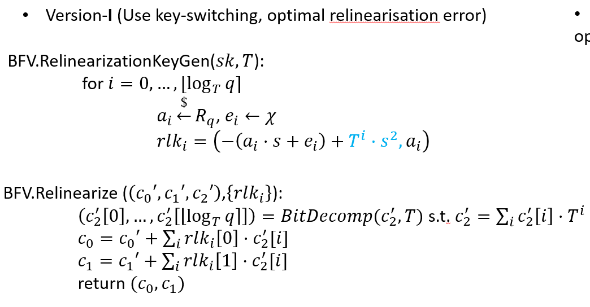
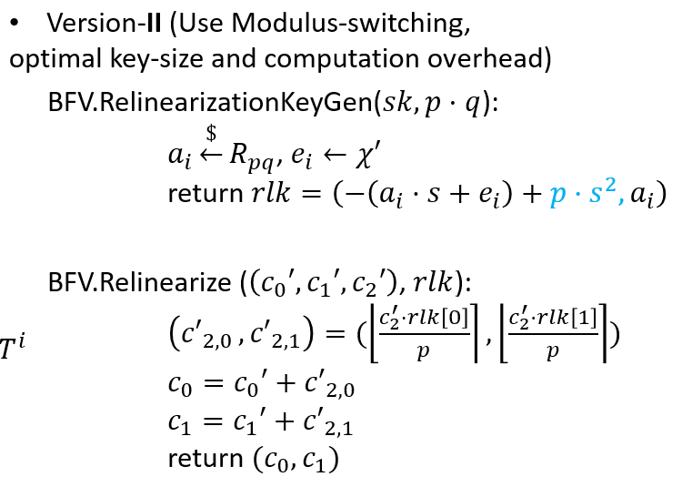

# BFV方案
BGV属于第二代FHE。最早有Junfeng Fan and Frederik Vercauteren于2012年在[这篇文章](https://eprint.iacr.org/2012/144)首次提出。
BFV最重要的贡献是在标准RLWE加密技术之上直接构造了FHE。

## 标准RLWE加密
在正式介绍BFV构造之前，回忆一遍标准RLWE加密的细节。


## BFV基本构造
 不同于BGV自己构造了一种新的RLWE变种，BFV构造直接建立在标准RLWE加密基础之上。整个密钥生成，加解密过程可用下图表示：
 <p align="center">
  
</p>

对BFV构造的一些解读：
1. 关于密钥生成，sk是从离散高斯分布（均值为0，方差很小）随机采样得到；pk本质是就是RLWE(0),所以pk和均匀分布在计算上不可区分。
2. 加密得到的ct本质上是有一对RLWE密文组成,即  。特别注意RLWE加密所用的密钥u是Alice随机生成的，Bob无法得知u。
3. 解密部分的核心是如何“消除”密钥u的影响，因为Bob不可能得到u，所以无法对ct直接解密。但是Bob知晓ct密文的一个结构特征：，从而  。

## BFV同态运算
这里具体讨论给定计算深度的同态计算模式，即leveled/somewhat FHE。

### 同态加法
加法很容易做到。只需要对相应的密文向量进行向量加法即可（另一种理解方法，将密文向量理解成degree-2 polynomial的系数向量，因此做多项式加法），噪声增长是加性的。

### 同态乘法
重点讨论乘法。首先将RLWE密文向量理解成degree-1 polynomial, 即  。

那么定义两个BFV密文的同态乘法运算(初始版本)如下：
<p align="center">

</p>
这个乘法定义借助多项式乘法就很好理解: 
<p align="center">

</p>
也就是说，BFV同态乘法的结果就是取相应密文多项式乘法结果的系数。

现在，有两个新问题要解决
1. BFV同态乘法得到的结果进行解密得到的是，而我们想要的是  。
2. 和BGV乘法类似的情况，需要做key-switch将三维的密文向量降到二维。

先讨论第一个问题。具体地，对BFV乘法结果解密得到 
<p align="center">

</p>
<div>那么对密文向量做‘rounding/rescale’(类似于Mod-Switch)就可以化简得到  。具体地，定义rounding/rescale 操作如下:</div>

<p align="center">

</p>

引理：

证明：首先我们有 , 这里  。令 ， 特别注意有  。
接着考虑 , 更进一步分析噪声分量有  
综上所述，总噪声的分布方差上限一定是一个小数目，具体数值为  。

现在讨论第二个问题 re-linearization, 即给定三维的密文向量，如何同态地约减到二维：
 <p align="center">
  
</p>

BFV设计了两种形式的re-linearization。第一种形式和BGV-FHE介绍的一样：
 <p align="center">
  
</p>

下面证明re-linearization第一种形式的正确性。首先注意到 
 <p align="center">
，</p>
 
 因此 
 <p align="center">
 
</p>

第二种形式的re-linearization借助了rescale思想：
 <p align="center">
  
</p>

下面证明re-linearization第二种形式的正确性。 这里需要利用关系式  。首先容易证明  ；接着做rescale得到  。

综上所述，完全形态的BFV同态乘法算法(输入  )如下：
1. 计算  
2. 做Rescale操作得 
3. 做Relinearization操作得  。


## Single Instruction Multiple Data 编码方式 (SIMD)
第二代FHE最强大的特性就是SIMD。以BFV方案为例，这意味着一个BFV密文可以对一个向量进行加密 (相当于加密多个数据构成的数组，而不是仅仅对一个数据进行加密）。 之所以能支持这个特性，是因为Number Theoretic Transform (NTT)的缘故。注意到BFV加密的明文是一个多项式 , NTT的本质是对m(X)在特定n个点上的估值，具体定义如下：

<p align="center">

</p>

NTT是一个线性运算，容易得到NTT的逆运算使得 。 因此利用NTT逆运算可以将一组向量编码成一个多项式，在FHE语境中，又称之为SIMD encoding 技术，即
<p align="center">

</p>

注意NTT蕴含了一个同构：两个换上多项式加法和乘法对应于NTT向量的对应点加法(component-wise addition)和对应点乘法(component-wise multiplication),即
<p align="center">


</p>

换句话说利用SIMD编码，单次FHE的加/乘运算相当于对明文向量做对应点加法/乘法（同时做n次模p加/乘法）， 这也是SIMD原本的含义。

最后给出SIMD编解码的一个例子程序演示这小结的内容。
```python
# -*- coding: utf-8 -*-

import numpy as np
import random
import math
import copy
# np.set_printoptions(threshold=np.inf)

class NTT:
	def __init__(self, NTT_param):
		self.N = NTT_param[0]
		self.qbit = NTT_param[1]
		# self.q = NTT_param[1]
		# self.psi = NTT_param[2]%self.q
		self.q, self.psi = NTT.NTT_paramGen(self.N, self.qbit)
		self.psi_inv = NTT.modinv(self.psi, self.q)
		self.omega = (self.psi*self.psi)%self.q
		self.omega_inv = NTT.modinv(self.omega, self.q)

		# create ntt-forward-transform matrix
		self.ntt_forward = [[0]*self.N for _ in range(self.N)]
		for i in range(self.N):
			base = pow(self.omega, i, self.q)
			for j in range(self.N):
				self.ntt_forward[i][j] = pow(base, j, self.q)

		# create ntt-backward-transform matrix
		self.ntt_backward = [[0]*self.N for _ in range(self.N)]
		for i in range(self.N):
			base = pow(self.omega_inv, i, self.q)
			for j in range(self.N):
				self.ntt_backward[i][j] = pow(base, j, self.q)

		# create pre-processing and post-processing lists
		self.psi_list = [None]*self.N
		self.psi_inv_list = [None]*self.N
		for i in range(self.N):
			self.psi_list[i] = pow(self.psi, i, self.q)
			self.psi_inv_list[i] = pow(self.psi_inv, i, self.q)


	

	@staticmethod
	def NTT_paramGen(N, qbit):
		# Find the biggest modulus q s.t. q = 1 mod 2N
		for i in range(100000):
			if NTT.is_prime(2**qbit-i) and (2**qbit-i)%(2*N) == 1:
				q = 2**qbit-i
				print ("Prime q = 2^" + str(qbit)+ "-" + str(i) + ' = ' + str(q))
				break
			if i == 100000-1:
				raise Exception("cannot find the prime q in NTT_paramGen(qbit, N)!")

		# find the primitive root of unity, the algorithm is implemented according to https://math.stackexchange.com/questions/158344/how-to-find-the-solutions-for-the-n-th-root-of-unity-in-modular-arithmetic
		prime_factor = NTT.factor(q-1)
		# print ("primitive generator of q is: " + str(prime_factor))
		testv = [int((q-1)/i) for i in prime_factor]
		for gen in range(1, q):
			flag = True
			gen = gen%q
			for v in testv:
				if pow(gen,v,q) == 1:
					flag = False
					break
			if flag == True:
				print ("2N-th primitive root of q is: " + str(pow(gen,int((q-1)/(2*N)), q)))
				break

		return (q, pow(gen,int((q-1)/(2*N)), q)) # return the prime number q and the 2N-th primitive root of unity (mod q) a.k.a. psi

	@staticmethod
	def factor(nr): # https://stackoverflow.com/questions/43129076/prime-factorization-of-a-number
		i = 2
		factors = []
		while i <= nr:
			if (nr % i) == 0:
				factors.append(i)
				nr = nr / i
			else:
				i = i + 1
		return factors

	@staticmethod
	def is_prime(n): # https://stackoverflow.com/questions/15285534/isprime-function-for-python-language/15285588
		if n == 2 or n == 3: return True
		if n < 2 or n%2 == 0: return False
		if n < 9: return True
		if n%3 == 0: return False
		r = int(n**0.5)
		# since all primes > 3 are of the form 6n ± 1
		# start with f=5 (which is prime)
		# and test f, f+2 for being prime
		# then loop by 6. 
		f = 5
		while f <= r:
			# print('\t',f)
			if n % f == 0: 
				return False
			if n % (f+2) == 0: 
				return False
			f += 6
		return True  

	@staticmethod
	def egcd(a, b):
		if a == 0:
			return (b, 0, 1)
		else:
			g, y, x = NTT.egcd(b % a, a)
			return (g, x - (b // a) * y, y)

	@staticmethod
	def modinv(a, m):
		g, x, y = NTT.egcd(a, m)
		if g != 1:
			raise Exception('modular inverse does not exist')
		else:
			return x % m

	@staticmethod
	def Barret_init(q):
		# precompute for Barret reduction
		k = math.ceil(math.log(q,2))
		r = ( 1 << 2*k )//q		
		return (r, k)

	@staticmethod
	def Barret_reduce(x, r, k, q): # x%q with a pre-computed factor r. For details, refer to https://www.nayuki.io/page/barrett-reduction-algorithm
		# Barret reduction works only if 0 <= x < q^2
		t = x - ((x*r) >> 2*k)*q
		# print ('xr : ', x*r)
		# print ('(x*r) >> 2*k : ', (x*r) >> 2*k)
		# print ('((x*r) >> 2*k)*q : ', ((x*r) >> 2*k)*q)
		# print ('x - ((x*r) >> 2*k)*q : ', x - ((x*r) >> 2*k)*q)
		if t < q:
			return t 
		else:
			return t-q

	# standard but slow NTT computation based on matrix-vector multiplication
	def NTT_forward(self, A): # A is a list of polynomial coefficients over Z_q
		# first perform pre-processing on A
		# A_vector = (np.array(A, dtype='object') * np.array(self.psi_list))%self.q
		A_vector = np.empty(len(A), dtype='object')
		(r, k) = NTT.Barret_init(self.q)
		# print ("Barret params: r = {r}, k = {k}".format(r = r, k = k))
		for i in range(len(A)):
			A_vector[i] = NTT.Barret_reduce(A[i]*self.psi_list[i], r, k, self.q)
		# then perform standard N-point NTT
		ntt_forward_matrix = np.array(self.ntt_forward, dtype='object')
		return (ntt_forward_matrix.dot(A_vector)%self.q).tolist()

	def NTT_backward(self, A): # A is a list of NTT evaluation points
		# first perform standard N-point NTT
		ntt_backward_matrix = np.array(self.ntt_backward, dtype='object')
		A_vector = np.array(A, dtype='object')
		A_vector = (ntt_backward_matrix.dot(A_vector)*NTT.modinv(self.N,self.q))%self.q
		# then perform post-processing on A
		return (A_vector*np.array(self.psi_inv_list, dtype='object')%self.q).tolist()
		# return (A_vector*1%self.q).tolist()

if __name__ == "__main__":

	N = 32 # number of NTT points
	qbit = 32

	inst = NTT([N, qbit])
	print ("system params for NTT: N = {N}, q = {q}, psi = {psi}, omega = {omega}\n\n".format(N = inst.N, q = inst.q, psi = inst.psi, omega = inst.omega))

	# test for BFV encoding
	m0_vec = [10]*N # prepare a random message vector of length N
	for i in range(N):
		m0_vec[i] = random.randint(0,inst.q-1)

	m0_poly = inst.NTT_backward(m0_vec) # apply inverse NTT to get the polynomial form (which returns the coefficient list, in ascending order of the power of X) the message vector


	if inst.NTT_forward(m0_poly) == m0_vec:
		print ("BFV encoding correct.")

	else:
		print ("BFV encoding incorrect!")	

	print ("message vector: ")
	print (m0_vec)
	print("\n")
	print ("message polynomial(after BFV encoding, coefficient list of the polynomial):")
	print (m0_poly)
```

## 比较BFV和BGV

