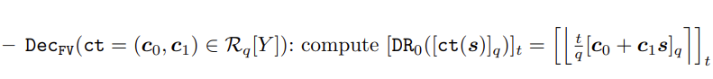
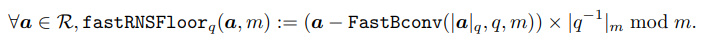
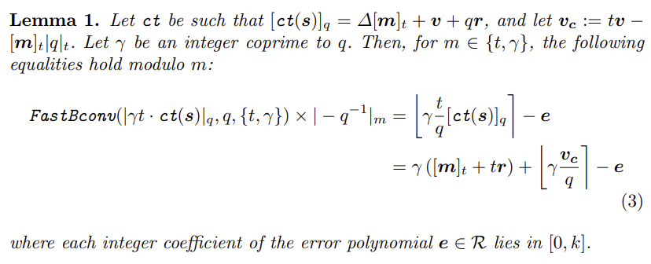

# RNS版本的BFV方案

这篇博文主要基于20116年的[BEHZ论文](https://eprint.iacr.org/2016/510)。目前所有实用的第二代FHE方案都是在RNS(Residue Number System, or Chinese Remainder Theorem Representation)上做的。这是因为RNS具有很高的计算并行度，并且可以利用计算机自带的整数类型(int32, int64)直接支持FHE方案需要的大数
（$\mathbf{F}_{p}, \text{p is at least hundreds of bits long}$)

在正常数制下的BFV的介绍可以参考我之前的[一篇博文](https://github.com/davidhoo1988/davidhu.github.io/edit/gh-pages/pages/BFV/main.md)。

## 预备知识
### 模运算 Modular Arithemtic
模运算是定义在整数上的一类运算，定义如下
$$a\bmod p = |a|_p=a-\lfloor \frac{a}{p}\rfloor \cdot p$$

注意$|a|_p\in [0,\cdots,p-1]$， 在LWE/FHE里，还会采用中心化的模运算定义如下
 

注意中心化的模运算的计算范围是 $[a]_p \in [-\lfloor\frac{p}{2}\rfloor , \lfloor\frac{p-1}{2}\rfloor]$

### 中国剩余定理 Chinese Remainder Theorem
中国剩余定理CRT阐述了一个整数环的自同构的存在，即 。 CRT蕴含着一个非进位的数制系统(non-positional number system)，现在一般称之为余数系统(Residue Number System, RNS)。在RNS下，一个大整数(mod q)的模运算可以被拆分成k个小整数的模运算,即  。通常每个小整数的模运算可以被绝大多数编程语言直接支持，因此大整数的模运算也可以被支持。RNS表示的数 $(a_1,\cdots,a_k)$ 可借由中国剩余定理恢复成原始大数 $a$，即

$$a= \sum_{i=1}^k|a_i\cdot \frac{q_i}{q}|_{q_i}\cdot \frac{q}{q_i} \bmod q $$

自然地，中国剩余定理可以推广到多项式环 

### RNS基转换
这里引入若干RNS下的计算工具，它们和BFV方案的基本操作密切相关。

首先引入快速基转换的概念。一个大整数在不同基下的RNS表示显然是不同的。现在需要从某组基q(这里基q指的是$\{q_i\}_{i=1,\cdots,k}$构成的一组基) 转换成另外一组基$\mathcal{B}=\{m_i\}_{i=1,\cdots,\ell}$。定义快速基转换如下:

  

注意这里的“快速”指的是不需要做mod q的操作（思考一下可知如果在FastBconv中使用mod q，其实就是中国剩余定理的形式）。作为代价，FastBconv算出来的是$x+\alpha_xq, \alpha_x\in[0,k-1]$ 而不是$x$

### BFV方案
简单回顾BFV方案如下:

 

  

注意这里的公钥 $pk=(\mathbf{p}_0, \mathbf{p}_1)=([-(\mathbf{as}+\mathbf{e})]_q, \mathbf{a})$, 且 
$\mathbf{p}_0+\mathbf{p}_1\mathbf{s}=-\mathbf{e}\approx 0$ 。

据此，容易证明 $[ct(\mathbf{s})]_q = [ct[0]+ct[1]\mathbf{s}]_q = [\Delta [\mathbf{m}]_t + \mathbf{v}]_q$。 这里 $\mathbf{v}$ 是密文 $ct$ 的内置噪声。
更详尽的介绍可以参考[这篇博文](https://github.com/davidhoo1988/davidhu.github.io/edit/gh-pages/pages/BFV/main.md)

## RNS版本下的 BFV-Decryption
简单回顾BFV的解密算法如下:
 

  

这里引入新的记号DR来表示‘division & rounding’的操作:
 

  

所以，这里的难度主要是如何在RNS下做DR操作。下面分三个小节详细介绍这部分

### 近似求解RNS rounding
在很多计算应用中，需要处理rounding操作，然而RNS并不支持rounding。 因此只能转而先求flooring，然后用flooring的结果近似rounding，即 

  

首先观察到 $\lfloor \frac{t}{q}[ct(\mathbf{s})]_q\rceil = \lfloor \frac{t}{q}|ct(\mathbf{s})|_q\rceil$, 因此有

这里不加证明的引入引理1，通过FastBconv近似计算$\left\lfloor \gamma\frac{t}{q}[ct(\mathbf{s})]_q\right \rceil$

  

对引理1做一些重要诠释。首先明确引理1实际上算的是$\left\lfloor \gamma\frac{t}{q}[ct(\mathbf{s})]_q\right \rceil$的近似值 $\left\lfloor \gamma\frac{t}{q}[ct(\mathbf{s})]_q\right \rceil - \mathbf{e}$, 这是由于FastBconv夹带的$\alpha_xq, \alpha_x\in[0,k-1]$造成的；

其次参数$\gamma$的引入是为了控制 $\left\lfloor \gamma\frac{\mathbf{v_c}}{q}\right \rceil$ 的大小，使得 
$\left\lfloor \gamma\frac{\mathbf{v_c}}{q}\right \rceil -\mathbf{e}\in [-\lfloor\frac{\gamma}{2}\rfloor , \lfloor\frac{\gamma-1}{2}\rfloor]$ 。方便下一小节引入修正方法最终去除掉 $\left\lfloor \gamma\frac{\mathbf{v_c}}{q}\right \rceil -\mathbf{e}$

### 修正RNS rounding近似算法中的误差
对引理1的结果直接做一次中心化模$\gamma$的操作就能直接得到 $\left\lfloor \gamma\frac{\mathbf{v_c}}{q}\right \rceil -\mathbf{e}$， 
消去这部分误差就可以得到精确地division&rounding的结果即 $\gamma([\mathbf{m}]_t+t\mathbf{r})$ 。

中心化模$\gamma$的操作的正确性来源于引理2：

  

也就是说，如果取合适大小的  使得  , 那么消去误差是可能的。

### RNS版本下的BFV-Decryption小结
至此，我们在算法1中描述完整的RNS版本的BFV-decryption方法:

  

对算法1做一些解释。第1-3行代码算出 $\mathbf{s}^{(t)}=\gamma[\mathbf{m}]_t+\lfloor\gamma\frac{\mathbf{v_c}}{q}\rceil -\mathbf{e} \bmod t, \mathbf{s}^{(\gamma)}= \lfloor\gamma\frac{\mathbf{v_c}}{q}\rceil -\mathbf{e}\bmod \gamma$ 。 

第4行代码算出误差项 $[\mathbf{s}^{(\gamma)}]_{\gamma}= \lfloor\gamma\frac{\mathbf{v_c}}{q}\rceil -\mathbf{e}$ 。 

第五行最终消去误差恢复出 $[\mathbf{m}]_t$ 。

最后，注意算法1正确返回  的前提是  满足一些bound:

  

## RNS版本下的 BFV-Multiplication
现在讨论一个比 RNS BFV-Decryption更困难的问题。

### 修改第二步 bit_decompose
现在讨论另外一种借助中国剩余定理CRT的bit_decompose方法。首先定义新的bit_decompose如下

接着定义power_expand如下

有了bit_decompose和power_expand的新定义，容易证明下面的引理:

  

借助引理7，可以阐述CRT版本的重线性化(relinearzation)算法。首先定义relinearzation key为 
 
回忆relinearzation的作用是将输入  变换成  且保证  。

## 一些重要的证明
