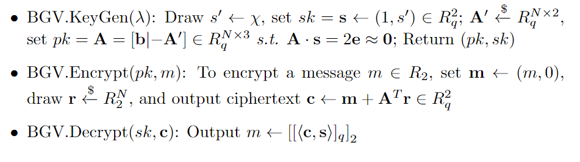

# BGV方案
第二代FHE主要是有BGV,BFV,和CKKS组成。这里介绍BGV。BGV最早有Zvika Brakerski, Craig Gentry和Vinod Vaikuntanathan于2012年在[这篇文章](https://eprint.iacr.org/2011/277)首次提出。
BGV最重要的贡献是提出了模数转换(Modular Switching)技术,有效地控制了同态运算带来的密文噪声增加，从而构造Leveled FHE：即这样的FHE可以实现给定计算深度的同态计算任务。但是，BGV并不能实现任意深度下的同态计算，不能算做真正意义上的FHE。

## 预备知识

### (R)LWE假设的一个变种
这里引入一个重要假设：

若  ，那么  。 这里  。

证明如下：依据RLWE假设，有  。又因为2和素数p互质，因此 
  

## BGV基本构造

  

下面简单论述BGV构造的正确性：

关于密钥生成KeyGen部分，最重要的是保持关系式 , 这样就可以保持pk和均匀分布不可区分。

关于加密Encrypt部分， 依据Left-Over Hash Lemma (LHL)可知 ， 最终可得  。

关于解密Decrypt部分，它的正确性可用 =\left<&space;\mathbf{m}&plus;\mathbf{A}^T\mathbf{r},&space;\mathbf{s}\right>=m&plus;2\mathbf{r}^T\cdot&space;\mathbf{e}\equiv&space;m&space;(\bmod&space;2)" /> 表示。

<!---title="https://latex.codecogs.com/svg.image?\left< \mathbf{c},\mathbf{s}\right>=\left< \mathbf{m}+\mathbf{A}^T\mathbf{r}, \mathbf{s}\right>=m+2\mathbf{r}^T\cdot \mathbf{e}\equiv m (\bmod 2)" -->

## BGV同态运算
BGV可以支持的运算包括加（减）法，乘法。乘法运算中的密文噪声增长很快，因此限制了BGV的运算深度。

### 同态加法
同态加法很容易做到，只需要将BGV密文视为向量，然后做相应的向量加法即可。也就是说，

### 同态乘法
同态乘法(  )就要困难多了。BGV的思路是对密文向量做张量乘法(tensor product)。

首先回忆张量乘法的定义:

依靠张量乘法，我们定义同态乘法如下:

|_q\right|_2&space;=&space;m_0\cdot&space;m_1" title="https://latex.codecogs.com/svg.image?\mathbf{c_{\times}}\gets\mathbf{c_0}\otimes \mathbf{c_1} s.t. \left||\left< \mathbf{c_{\times}}, \mathbf{s}\otimes\mathbf{s}\right>|_q\right|_2 = m_0\cdot m_1" />

证明：一方面有 &space;\cdot&space;\left<&space;\mathbf{c_1},\mathbf{s}\right>=(\sum_{i=0}^{i=1}\mathbf{c_{0,i}}\cdot\mathbf{s_i})\cdot&space;(\sum_{j=0}^{j=1}\mathbf{c_{1,j}}\cdot\mathbf{s_j})=\sum_i\sum_j\mathbf{c_{0,i}c_{1,j}}\cdot&space;\mathbf{s_is_j}" title="https://latex.codecogs.com/svg.image?\left<\mathbf{c_0},\mathbf{s} \right> \cdot \left< \mathbf{c_1},\mathbf{s}\right>=(\sum_{i=0}^{i=1}\mathbf{c_{0,i}}\cdot\mathbf{s_i})\cdot (\sum_{j=0}^{j=1}\mathbf{c_{1,j}}\cdot\mathbf{s_j})=\sum_i\sum_j\mathbf{c_{0,i}c_{1,j}}\cdot \mathbf{s_is_j}" />

另一方面有 &space;\cdot&space;\left<&space;\mathbf{c_1},\mathbf{s}\right>=(m_0&plus;2\cdot&space;noise_0)\cdot&space;(m_1&plus;2\cdot&space;noise_1)=m_0m_1&plus;2\cdot&space;noise" title="https://latex.codecogs.com/svg.image?\left<\mathbf{c_0},\mathbf{s} \right> \cdot \left< \mathbf{c_1},\mathbf{s}\right>=(m_0+2\cdot noise_0)\cdot (m_1+2\cdot noise_1)=m_0m_1+2\cdot noise" /> 。综合两个方面得证。

这里引入新的符号系统方便更进一步表述BGV方案:

## 重线性化 （Re-linearization）

上述利用张量乘法实现同态乘有一个重大缺陷：密文长度翻倍！在做乘法之前密文长度是， 乘法之后密文长度是  。为了将同态乘得到密文长度变的和同态乘前的密文长度一致，我们希望有下面的同态运算:

&space;\cdot&space;\left<&space;\mathbf{c_1},\mathbf{s}\right>=\sum_i\sum_j\mathbf{c_{0,i}c_{1,j}}\cdot&space;\mathbf{s_is_j}\xrightarrow[]{re-linearize}&space;\sum_{k=0}^{k=1}c_k\cdot&space;s_k'" title="https://latex.codecogs.com/svg.image?\left<\mathbf{c_0},\mathbf{s} \right> \cdot \left< \mathbf{c_1},\mathbf{s}\right>=\sum_i\sum_j\mathbf{c_{0,i}c_{1,j}}\cdot \mathbf{s_is_j}\xrightarrow[]{re-linearize} \sum_{k=0}^{k=1}c_k\cdot s_k'" />

注意到对应的密文是二次结构，而目标密文对应的密钥是线性结构。所以称之为重线性化。换句话，我们希望可以同态地变换密钥，借着密钥变换算法(Key Switching),容易做到：

## 噪声控制
接下来讨论BGV同态运算的噪声增长。同态加法的噪声是线性增长，因此增长缓慢，对解密正确性的影响微乎其微；同态乘法的增长是二次型，因此增长迅速，BGV方案的一个重要议题就是如果控制乘法运算中的噪声。

## BGV Bootstrapping
Bootstrapping使得BGV从leveled FHE变换成FHE。它的技术细节很复杂，不在这里描述。
