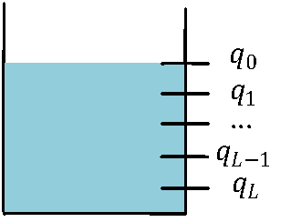

# BGV方案
第二代FHE主要是有BGV,BFV,和CKKS组成。这里介绍BGV。BGV最早有Zvika Brakerski, Craig Gentry和Vinod Vaikuntanathan于2012年在[这篇文章](https://eprint.iacr.org/2011/277)首次提出。
BGV最重要的贡献是提出了模数转换(Modular Switching)技术,有效地控制了同态运算带来的密文噪声增加，从而构造Leveled FHE：即这样的FHE可以实现给定计算深度的同态计算任务。但是，BGV并不能实现任意深度下的同态计算，不能算做真正意义上的FHE。

## 预备知识

### (R)LWE假设的一个变种
这里引入一个重要假设：

若  ，那么  。 这里  。

证明如下：依据RLWE假设，有  。又因为2和素数p互质，因此 

综上说述，我们定义新的RLWE加密为  。

### 模数变换(Modular Switching)
给定一个RLWE密文 ，定义模数变化如下: 

正确性证明：首先引入一些证明需要的符号。令 |_Q=\left<\mathbf{c},\mathbf{s}\right>-kQ&space;" title="https://latex.codecogs.com/svg.image?|\left<\mathbf{c},\mathbf{s}\right>|_Q=\left<\mathbf{c},\mathbf{s}\right>-kQ " /> ，对于同一个k，定义 -kq" title="https://latex.codecogs.com/svg.image?e_q=\left<\mathbf{c'},\mathbf{s}\right>-kq" /> 。 需要证明的最终目标是  。为了证明这个最终目标需要证明两个小目标：

1.|_Q|_2" title="https://latex.codecogs.com/svg.image?|e_q|_2=||\left<\mathbf{c},\mathbf{s}\right>|_Q|_2" />
证明: -kq|_2=|\left<\mathbf{c},\mathbf{s}\right>-kQ|_2=||\left<\mathbf{c},\mathbf{s}\right>|_Q|_2" title="https://latex.codecogs.com/svg.image?|e_q|_2=|\left<\mathbf{c'},\mathbf{s}\right>-kq|_2=|\left<\mathbf{c},\mathbf{s}\right>-kQ|_2=||\left<\mathbf{c},\mathbf{s}\right>|_Q|_2" />

2. |_q" title="https://latex.codecogs.com/svg.image?|e_q|<q/2~s.t.~e_q = |\left<\mathbf{c'},\mathbf{s}\right>|_q" />
证明：注意这里  是多项式，所以需要证明  这个多项式的每一个系数都比较小()。

## BGV基本构造

  

下面简单论述BGV构造的正确性：

关于密钥生成KeyGen部分，最重要的是保持关系式 , 这样就可以保持pk和均匀分布不可区分。

关于加密Encrypt部分， 依据Left-Over Hash Lemma (LHL)可知 ， 最终可得  。

关于解密Decrypt部分，它的正确性可用 =\left<&space;\mathbf{m}&plus;\mathbf{A}^T\mathbf{r},&space;\mathbf{s}\right>=m&plus;2\mathbf{r}^T\cdot&space;\mathbf{e}\equiv&space;m&space;(\bmod&space;2)" /> 表示。

<!---title="https://latex.codecogs.com/svg.image?\left< \mathbf{c},\mathbf{s}\right>=\left< \mathbf{m}+\mathbf{A}^T\mathbf{r}, \mathbf{s}\right>=m+2\mathbf{r}^T\cdot \mathbf{e}\equiv m (\bmod 2)" -->

## BGV同态运算
BGV可以支持的运算包括加（减）法，乘法。乘法运算中的密文噪声增长很快，因此限制了BGV的运算深度。

### 同态加法
同态加法很容易做到，只需要将BGV密文视为向量，然后做相应的向量加法即可。也就是说，

### 同态乘法
同态乘法(  )就要困难多了。BGV的思路是对密文向量做张量乘法(tensor product)。

首先回忆张量乘法的定义:

依靠张量乘法，我们定义同态乘法如下:

|_q\right|_2&space;=&space;m_0\cdot&space;m_1" title="https://latex.codecogs.com/svg.image?\mathbf{c_{\times}}\gets\mathbf{c_0}\otimes \mathbf{c_1} s.t. \left||\left< \mathbf{c_{\times}}, \mathbf{s}\otimes\mathbf{s}\right>|_q\right|_2 = m_0\cdot m_1" />

证明：一方面有 &space;\cdot&space;\left<&space;\mathbf{c_1},\mathbf{s}\right>=(\sum_{i=0}^{i=1}\mathbf{c_{0,i}}\cdot\mathbf{s_i})\cdot&space;(\sum_{j=0}^{j=1}\mathbf{c_{1,j}}\cdot\mathbf{s_j})=\sum_i\sum_j\mathbf{c_{0,i}c_{1,j}}\cdot&space;\mathbf{s_is_j}" title="https://latex.codecogs.com/svg.image?\left<\mathbf{c_0},\mathbf{s} \right> \cdot \left< \mathbf{c_1},\mathbf{s}\right>=(\sum_{i=0}^{i=1}\mathbf{c_{0,i}}\cdot\mathbf{s_i})\cdot (\sum_{j=0}^{j=1}\mathbf{c_{1,j}}\cdot\mathbf{s_j})=\sum_i\sum_j\mathbf{c_{0,i}c_{1,j}}\cdot \mathbf{s_is_j}" />

另一方面有 &space;\cdot&space;\left<&space;\mathbf{c_1},\mathbf{s}\right>=(m_0&plus;2\cdot&space;noise_0)\cdot&space;(m_1&plus;2\cdot&space;noise_1)=m_0m_1&plus;2\cdot&space;noise" title="https://latex.codecogs.com/svg.image?\left<\mathbf{c_0},\mathbf{s} \right> \cdot \left< \mathbf{c_1},\mathbf{s}\right>=(m_0+2\cdot noise_0)\cdot (m_1+2\cdot noise_1)=m_0m_1+2\cdot noise" /> 。综合两个方面得证。

这里引入新的符号系统方便更进一步表述BGV方案:

## 重线性化 （Re-linearization）

上述利用张量乘法实现同态乘有一个重大缺陷：密文长度翻倍！在做乘法之前密文长度是， 乘法之后密文长度是  。为了将同态乘得到密文长度变的和同态乘前的密文长度一致，我们希望有下面的同态运算:

&space;\cdot&space;\left<&space;\mathbf{c_1},\mathbf{s}\right>=\sum_i\sum_j\mathbf{c_{0,i}c_{1,j}}\cdot&space;\mathbf{s_is_j}\xrightarrow[]{re-linearize}&space;\sum_{k=0}^{k=1}c_k\cdot&space;s_k'" title="https://latex.codecogs.com/svg.image?\left<\mathbf{c_0},\mathbf{s} \right> \cdot \left< \mathbf{c_1},\mathbf{s}\right>=\sum_i\sum_j\mathbf{c_{0,i}c_{1,j}}\cdot \mathbf{s_is_j}\xrightarrow[]{re-linearize} \sum_{k=0}^{k=1}c_k\cdot s_k'" />

注意到对应的密文是二次结构，而目标密文对应的密钥是线性结构。所以称之为重线性化。换句话，我们希望可以同态地变换密钥，借着密钥变换算法(Key Switching),容易做到：

## 噪声控制
接下来讨论BGV同态运算的噪声增长。同态加法的噪声是线性增长，因此增长缓慢，对解密正确性的影响微乎其微；同态乘法的增长是二次型，因此增长迅速，BGV方案的一个重要议题就是如果控制乘法运算中的噪声。

  

BGV控制噪声的方式是构造一个模数'梯子'(ladder of moduli)。这个梯子是有一系列从大到小排列的模数构成的数组  。每做一次同态乘法，使用模数变换(Modulus Switching)将定义在较大模数
 上的密文变换成较小模数  上的密文。因为模数变换可以减小噪声，因此同态乘法中的噪声得以控制。这个过程可以用‘[油箱加油](./fig/ladder_of_moduli.png)’加以说明。BGV初始化使用的最大模数为 , 接着做了一次同态乘法BGV.mul,噪声显著变大，应用模数变换将BGV密文变换到较小的  从而抑制噪声增长，但无论如何抑制，噪声一定会相应增加（只是相对的缓慢增加）。形象地说明，相当于油箱的油量从刻度  下降到  。注意到使用模数变换控制噪声的手段只能使用有限次，为了保证BGV方案解密的正确性，模数不能无限制一直变小下去。假定允许的最小模数记为  ，也就是说最多做L次乘法，油箱的油就耗尽了，无法继续再做同态乘法操作。这种给定乘法次数(深度)的同态加密形式通常称之为leveled FHE。

更具体地，假定BGV最开始的噪声（比如此时BGV工作在模数  上）幅值大约为x, 即  。准备模数梯子  , 现在做一次同态乘法得到 ，最后做一次模数变换使得  。

## 小结
这里总结BGV同态乘法最终算法如下：

## BGV Bootstrapping
Bootstrapping使得BGV从leveled FHE变换成FHE。它可以将一个较小模数定义下的密文同态转换成一个较大模数定义下的密文，相当于给油箱又‘加了油’。它的技术细节很复杂，不在这里描述。
