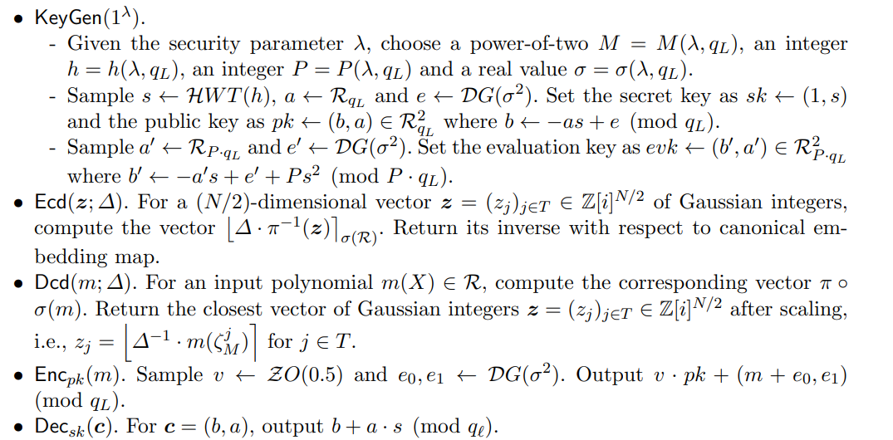
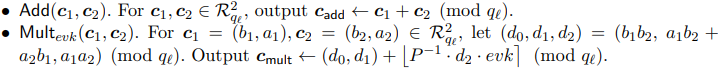
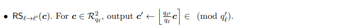

# CKKS方案
CKKS区别于BFV最突出的地方就在于SIMD编码。BFV利用SIMD加密的是一个整型向量，而CKKS利用SIMD加密的是一个浮点型向量(更精确地说是复数型向量)

## SIMD编码
CKKS SIMD编解码过程可以用下面表示:

<p align="center">
  
</p>

对CKKS SIMD编码特征的一些解读
1. CKKS-SIMD沟通的是浮点型向量和整型多项式，也就是CKKS-SIMD的目的是将浮点型向量编码成整型多项式
2. CKKS明文多项式的度为N，CKKS-SIMD只能编码N/2个数，而不是像BFV那样可以编码N个数
3. CKKS的编码是近似的，存在误差的，即 $m(\xi^i)_{i=1,3,\cdots,N-1}\approx \Delta(z_0,\cdots,z_{N/2})=\Delta\cdot \mathbf{z}$

正式介绍SIMD编码之前，引入两个记号$\pi^{-1}(\cdot)$(共轭拓展) 和 $\sigma^{-1}(\cdot)$（FFT逆运算）:
$$(z_0,\cdots,z_{\frac{N}{2}-1})\overset{\pi^{-1}(\cdot)}{\longrightarrow} (z_0,\cdots,z_{N-1})$$
$\pi^{-1}(\cdot)$的目的是将一个长度为N/2的向量扩展成长度为N的向量，使得 $z_{N-1-i}=conjugate(z_i),i=0,\cdots,\frac{N}{2}-1)$。

$$(z_0,\cdots,z_{\frac{N}{2}-1})\overset{\pi^{-1}(\cdot)}{\longrightarrow} (z_0,\cdots,z_{N-1})$$
$\sigma^{-1}(\cdot)$本质上是做一次类似FFT的操作，使得 $m'(\xi^{2i+1})=z_{i}$ 这里$\xi=e^{\frac{2\pi j}{2N}} \text{ is a 2N-th primitive root of unity }$

注意这里会碰到一个问题：$\sigma^{-1}(\cdot)$将一个定义在复数上的向量变换成一个定义在实数上的多项式，而CKKS的基本操作对象是定义在整数上的多项式，因此不能直接操作$\sigma^{-1}(\cdot)$编码后得到的实数多项式，需要提出额外的方法来解决这个问题。

CKKS论文解决这个问题的思路是利用rounding，rounding造成的额外误差可以视作RLWE密文噪声的一部分，只要噪声幅度控制合适，就不会影响编码和加解密的正确性。
编码算法分两步进行：
1. 对明文向量做一次FFT逆运算得到多项式m'(X)，
2. 对多项式m'(X)做rounding输出最终的整型多项式m(X), 即  。

对encoding的一些解读：
1. 注意到第一步中使用  扩展明文多项式，这是因为FFT计算的共轭对称性特决定的,即  。
2. 第二步的rounding存在这样的关系式：，将r(X)视为RLWE Error的一部分。
3. $\Delta$的目的主要是保持编码的精度。比如$\Delta=1024$意味着输入明文的高10bit位是精确的，其他低位因为rounding操作被截取，因此低位部分是不精确的。

最后给出SIMD编解码的一个python例子程序（需要在[SageMath](https://www.sagemath.org/)中运行）演示这小结的内容。

<details><summary>点击这里展示代码</summary>
<p>
	
```python
# -*- coding: utf-8 -*-
  reset() # clear all variables

R = PolynomialRing(CC, 'x')
M = 8
N = M/2
Delta = 1024

###############################################################
# the encoding&decoding method used in the original CKKS paper
# evaluate at the 2N-th primitive roots of X^N + 1 (N roots in total)
###############################################################

root1 = exp(-2*pi*i/8)
root3 = exp(-2*pi*i*3/8)
root5 = exp(-2*pi*i*5/8)
root7 = exp(-2*pi*i*7/8)
root = [root1, root3, root5, root7]

# apply pi_inverse transform to keep conjugation preserved
# z = [3-4*i,2+i,2-i,3+4*i]
z = [3.14, 2.718, 2.718, 3.14]

# Lagrange interpolate the polynomial testpoly, i.e., the mapping sigma^{-1}
# testpoly = R.lagrange_polynomial([(root1,z[0]),(root3,z[1]),(root5,z[2]),(root7,z[3])]); 
sigma = Matrix([[root[0]^0,root[0]^1,root[0]^2,root[0]^3], [root[1]^0,root[1]^1,root[1]^2,root[1]^3], [root[2]^0,root[2]^1,root[2]^2,root[2]^3], [root[3]^0,root[3]^1,root[3]^2,root[3]^3]])
sigma_inv = sigma.inverse()
m1_vec = sigma_inv*Matrix(z).transpose()
m1_list = m1_vec.list()
m1_list = [m1_list[i].real_part() for i in range(len(m1_list))]
testpoly = R(m1_list) 

# Multiplied by Delta
m = Delta*testpoly

# Rounding a real-number polynomial to integer polynomial over R
m_list = m.list()
for i in range(len(m_list)):
	m_list[i] = ZZ(round(m_list[i].real_part()))
m = R(m_list)
######Encoding function ends######

######Decoding function begins######
# multiplied by 1/Delta
testpoly = m/Delta

# evaluate testpoly at roots of unity, i.e., the mapping sigma
zz = [0]*4
for i in range(len(zz)):
	zz[i] = CC(testpoly(x=root[i]))


######Decoding function ends######

print ("input vector before encoding: ")
print (z)

print ("output vector after encoding")
print (zz)

print ("difference between before-encoding and after-encoding")
print ([z[i] - zz[i] for i in range(len(z))])
  ```	 
  
</p>
</details>

## CKKS 密钥生成和加解密

密钥生成和加解密算法如下：
<p align="center">
  
</p>

对密钥生成和加解密的一些解读
<div>
1. 密钥生成器KeyGen输出的pk其实是RLWE(0); 另外同态乘法需要额外的re-linearization操作。该操作需要生成evk(rlk)，可以简单理解成对s平方的加密，即  。</div>
<div>
2. Ecd部分没什么好说的，已经在上一小节介绍； Dcd做的实际上是 , 容易知道 , 通过合理设置参数使得  非常小，从而保证  。</div>


## CKKS同态运算

CKKS的主要同态操作包括加法，乘法，缩放(rescale), 和循环移位。
<p align="center">
  
  
</p>

对同态运算的一些解读
<div>
1. 同态加法和BFV加法一致，都是对应密文向量加法。
</div>
<div>
2. 同态乘法和BFV乘法一致，这里用的是BFV的第二种重线性化方法，即  。
</div>
<div>
3. rescale是CKKS的一个独有的同态操作，其本质就是Mod-Switch。但是在CKKS里它有独特的意义：
</div>

## CKKS同态运算噪声分析

加法的噪声容易分析，为 $Err(\mathbf{c_{add}})\sim N(0,2\sigma_{\ell}^2)$, 这里用$\sigma_{\ell}^2$表示Level-$\ell$的密文噪声方差。

乘法的噪声分析分成两部分。第一部分来自$Err(d_0,d_1,d_2) = m_1e_2+m_2e_1+e_1e_2$；接着做re-linearization,噪声变换为:
$$Err(\lfloor \frac{d_2\cdot evk}{P}\rceil)=Err(\lfloor  P^{-1}\cdot(d_2a',d_2b')\rceil)= Err((\lfloor\frac{d_2a'}{P}\rceil , \lfloor \frac{-d_2a's+d_2e'+Pd_2s^2}{P}\rceil))=\frac{d_2e'}{P}+r_as+r_b$$
这里令 $r_a =\lfloor\frac{d_2a}{P}\rceil - \frac{d_2a}{P}, r_b =\lfloor\frac{d_2b}{P}\rceil - \frac{d_2b}{P}$。综合这两部分可得总噪声为:

$$m_1e_2+m_2e_1+e_1e_2+\frac{d_2e'}{P}+r_as+r_b$$

Rescale的噪声分析和BFV Mod-Switch的分析方法是一致的。
