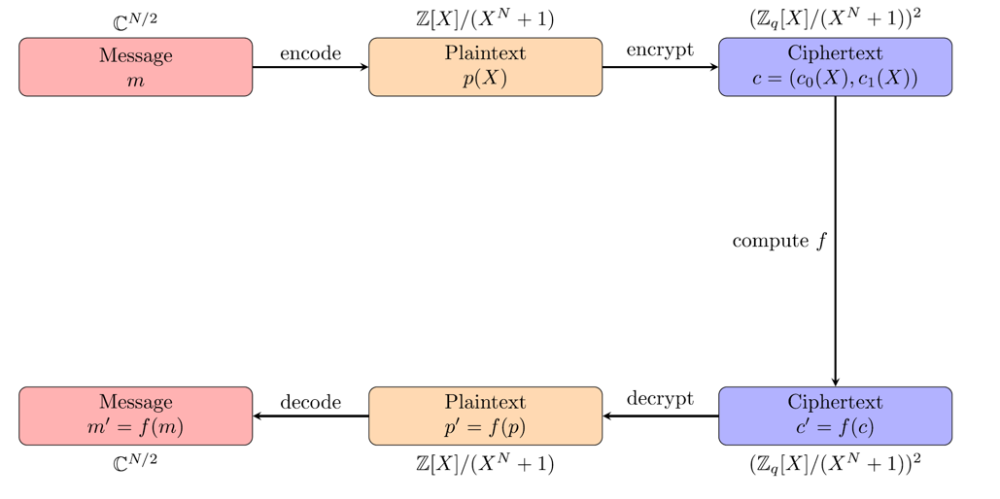

# CKKS方案
CKKS区别于BFV最突出的地方就在于SIMD编码。BFV利用SIMD加密的是一个整型向量，而CKKS利用SIMD加密的是一个浮点型向量(更精确地说是复数型向量)

## SIMD编码
CKKS SIMD编解码过程可以用下面表示:

  

对CKKS SIMD编码特征的一些解读
1. CKKS-SIMD沟通的是浮点型向量和整型多项式，也就是CKKS-SIMD的目的是将浮点型向量编码成整型多项式
2. CKKS明文多项式的度为N，CKKS-SIMD只能编码N/2个数，而不是像BFV那样可以编码N个数
3. CKKS的编码是近似的，存在误差的，即 $m(\xi^i)_{i=1,3,\cdots,N-1}\approx \Delta(z_0,\cdots,z_{N/2})=\Delta\cdot \mathbf{z}$

正式介绍SIMD编码之前，引入两个记号$\pi^{-1}(\cdot)$(共轭拓展) 和 $\sigma^{-1}(\cdot)$（FFT逆运算）:
$$(z_0,\cdots,z_{\frac{N}{2}-1})\overset{\pi^{-1}(\cdot)}{\longrightarrow} (z_0,\cdots,z_{N-1})$$
$\pi^{-1}(\cdot)$的目的是将一个长度为N/2的向量扩展成长度为N的向量，使得 $z_{N-1-i}=conjugate(z_i),i=0,\cdots,\frac{N}{2}-1)$。

$$(z_0,\cdots,z_{\frac{N}{2}-1})\overset{\pi^{-1}(\cdot)}{\longrightarrow} (z_0,\cdots,z_{N-1})$$
$\sigma^{-1}(\cdot)$本质上是做一次类似FFT的操作，使得 $m'(\xi^{2i+1})=z_{i}$ 这里$\xi=e^{\frac{2\pi j}{2N}} \text{ is a 2N-th primitive root of unity }$
