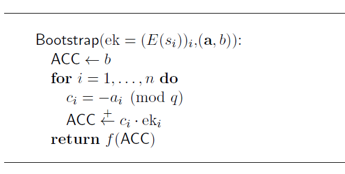
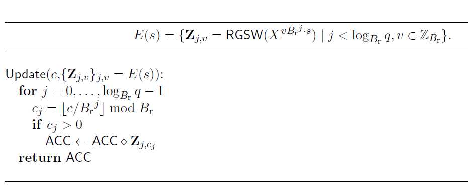
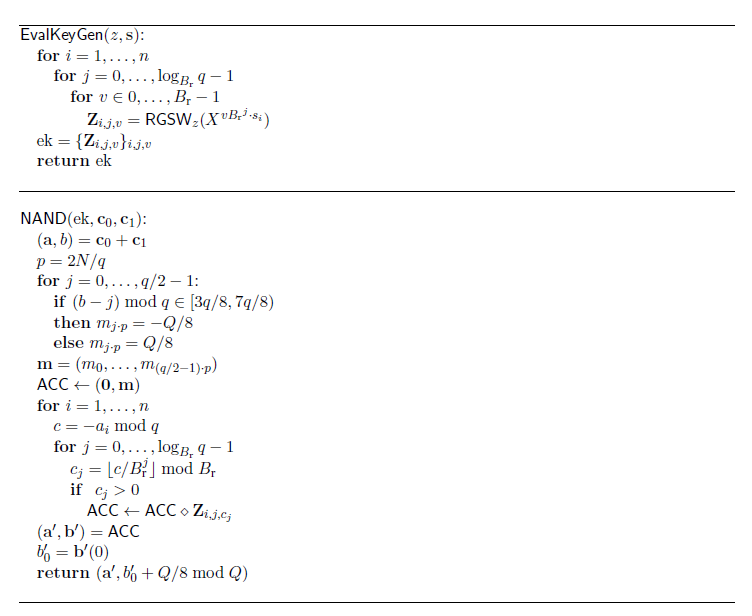

# FHEW介绍

FHEW是开启第三代FHE的标志性方案。该方案主要是Leo Ducas和Daniele Micciancio在2014年提出并设计。原始论文参考[这里](https://eprint.iacr.org/2014/816.pdf)。与第二代FHE方案相比，bootstrapping的性能得到大幅度提升，在常见的台式机平台上速度可以达到毫秒级别；但同时因为缺少第二代FHE的SIMD特性，FHEW只能处理若干比特的加法和乘法操作，也就是说同态乘法的性能较差。

## 预备知识
### Learning With Errors (LWE) 对称加密
这里将对明文m的LWE加密标注成=(\mathbf{a},b)). 其中 &plus;e&plus;\frac{q}{t}m&space;\bmod&space;q" title="\mathbf{b}=<\mathbf{a},\mathbf{s}>+e+\frac{q}{t}m \bmod q" />

已知密钥，则可以对=(\vec{a},b))做解密操作，算法如下：

### 模数变换（Modular Switching） 和 密钥变换 （Key Switching）
这里引入FHE方案中的两个重要基本操作Modular Switching(M.S.) 和 Key Switching(K.S.)。它们会反复地出现在FHE系列的文章中。我们不加证明的使用如下结论：

也就是说模数变换可以把LWE instance的大模数Q变换成小模数q(Q>q)，而不改变加密的明文m以及密钥s；
密钥变换则把LWE instance的密钥从原先的向量z变成向量s，而不改变模数q和明文m。

## FHEW顶层逻辑结构
FHEW方案的输入是两个比特的密文，输出的是对这两个加密比特进行一次同态门运算得到相应比特的密文。

### 同态与非门逻辑(Homomorphic NAND gate)
特别地，与非门逻辑是研究的重点。因为实现了与非门，实际上等同于实现了其他所有逻辑(universal logic)。话句话说，我们希望构造这样的同态与非逻辑实现如下运算:

这里我们忽略[原始论文](https://eprint.iacr.org/2014/816.pdf)中的相关描述，转而使用[论文](https://eprint.iacr.org/2020/086.pdf)中关于同态查找表(look-up table, LUT)的描述，该表述更富有直觉性，同时也被后续研究发展成functional bootstrap。

基本思路如下，首先我们应该知道同态加法是容易做的，即。接下来的目标是同态地将 映射成 ，该映射可以用下面表格表示：

(a,b) | a+b  | NAND(a,b)
----  | ---- | ----
(0,0) | 0    | 1
(0,1) | 1    | 1
(1,0) | 1    | 1
(1,1) | 2    | 0

也就是说，这里的重难点是如何同态地构造这样的LUT函数f，可以把0映射成1，1映射成1，2映射成0。

### 同态累加器(Homomorphic Accumulator)
这里定义累加器ACC的三个基本操作如下：
1. Initialize: ,将ACC存储内容初始化成一个已知数值b
2. Update: , 以累加的方式对ACC进行更新，即将变换为
3. Extract: , 若当前ACC存的是v,即ACC[v]，那么f(ACC)表示的对f(v)的加密，即。

注意到Update操作中的s是LWE密钥不可以暴露，否则整个密码系统安全性就回崩溃。因此需要对s进行一次加密变换成E(s)后发布。这个对s进行加密生成的密文在FHE语境里称之为bootstrapping key（有的文章称之为evaluation key或者refreshing key）

  
 

 
 接着，我们尝试理解“ACC的三个操作为什么可以完成bootstrapping？”这个问题。Bootstrapping的本质是同态地做LWE解密。注意到LWE解密操作的第一步需要做一次这样的线性操作使得：
 

  
   

  因此ACC的首要目标是同态地做这个线性操作，这个目标可以利用Initialize和Update操作完成：首先调用Initialize操作1次做:
  

   
  

  将ACC初始化成b; 接着调用Update操作n次做:
  

  
  

  此时可得我们想要的形式，即：
  

  
  

  
  到了这一步，假如我们可以同态的计算映射函数f（f也被称之为rounding function,如何构造它是FHEW方案中的难点部分，会在稍微章节介绍),那么就完成了整个同态异或的运算，即:
    

  
    

    
  利用同态累加器ACC,我们用下面这个算法([算法1](fig/alg1.png))来描述FHEW bootstrapping的整个过程：
  

  
   

   至此，我们从顶层描述了FHEW bootstrapping的原理。下面对ACC的三个基本操作initialize, update, 和 extract做更详细的阐述。
   
   
   #### 初始化 Initialize
   在初始化过程中，需要将LUT函数f也编码进去，即。
   这里使用无噪声的RLWE加密m，即
    

   
    

  
注意这里,但实际上FHEW将m定义在一个更大的整数多项式环使得是它的子环。使用更大的环的原因是安全性考虑。只有环足够大才能使得相应的RLWE问题足够难从而达到相应的安全级别。

  
  #### 更新 Update
Update操作的核心是同态乘法算法（）。
注意bootstrapping key的实质是对LWE密钥进行加密。更具体地说，对LWE密钥向量中的每一个元素，即, 进行GSW加密得到:
 

 

那么，Update操作可以按以下流程计算得到：

1. 
将c"扁平化"得到

2. 依次对所有的j,做同态乘法操作

[算法2](fig/alg2.png)形式化地描述Update操作如下图所示。
  

  
   

   
  #### 提取 Extraction
  在提取过程中，LUT function（也称之为rounding function）是至关重要的。现在考虑FHEW的输入密文的具体形式。它满足 
  
  同态NAND逻辑的输入是上面形式的两个LWE密文，即  和 。首先将两端密文相加得 
   

  
   

   
   那么rounding function f需满足
   1.  舍入到最近的  的整数倍
   2. 映射规律：
   3. 映射之后得到的一比特信息缩放  倍（这是因为extraction最终得到 这样的形式，需要做一次Key-Switching和一次Modular-Switching 恢复成  ）

总而言之，函数f应当将区间  映射到 ； 映射到 。但这里存在一个问题：f必须满足负周期性f(v+q/2)=-f(v)，因此上述映射关系不能直接满足。解决方案是把  映射到 ， 映射到 ，这样得到  。最后加入无噪声的LWE密文  得到目标映射:
 

 

到这里我们可以完整地给出详细的FHEW bootstrapping[算法3](fig/alg3.PNG)如下
  

  
   

   关于算法3的注释：首先讨论EvalKeyGen()。Evaluation Key的本质是用密钥z对密钥s进行加密。因为Bootstrapping中需要做形如  的计算。为了更好的控制噪声增长，需要对c扁平化，即做 。相应的需要存储 。这样，只需要做几次同态加法即可得到:

  

 

