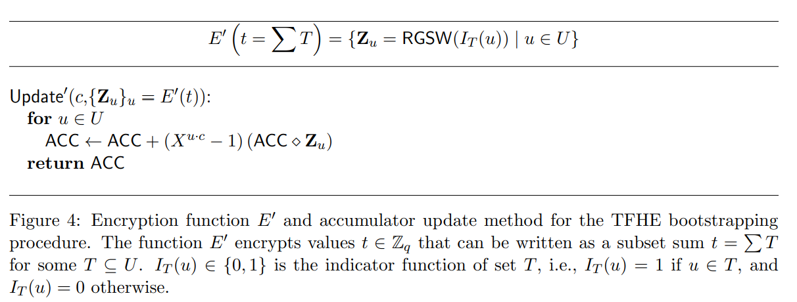
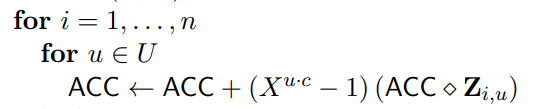

# FHE噪声增长分析

## 预备知识

### 关于erf函数
误差函数(error function)是统计学中的一个重要函数。在FHE噪声分析中我们使用误差函数来估计噪声幅度在某个区间的概率。如果这个概率非常接近1，那么认定噪声只在该区间抖动变化。erf函数的定义如下:

 

 
引入erf函数的一个重要性质，该性质沟通了erf函数和高斯分布:

 

 
 对上式做一些简单变换，可得：

也就是说，一个服从高斯分布的随机变量出现在区间[-x,+x]的概率可以用erf函数直接计算。

### 高斯分布的叠加性

## FHE密文被正确解密的概率
我们回到FHE噪声分析的核心问题，那就是“给定FHE密文噪声分布(通常是均值为0，方差为  的高斯分布)，那么该密文可以被正确解密的概率是多少？” 注意这里正确解密的含义是  。这就表明噪声随机变量e应该以大概率出现在区间  。等价的表述方式是e落在区间  之外的概率是可忽略的(例如概率为  ):

 

实践表明上面的分析方法是悲观的，即实际FHEW的解密错误概率通常比上式得到的概率要小的多。因此FHEW论文提供另外一种分析方法。这里我们避开分析单个FHE密文可解密的概率，转而分析两个(独立)FHE密文的噪声之和。假定单个FHE密文  的噪声满足  。那么两个独立FHE密文的噪声之和应满足  。因此FHEW用下式来估算解密的出错概率：

 

## 密钥变换/模数变换对FHEW密文噪声的影响
这里分析一下密钥变换和模数变换的正确性和噪声增长。

### 模数变换
给定一个LWE密文  , 定义LWE模数变换如下：

引理: 如果输入的LWE密文(高斯)噪声  标准差为  ，那么  输出的LWE密文(高斯)噪声标准差为 , 这里

*证明* 首先我们有  。这里  。
经过计算可得  。依据中心极限定理和高斯分布叠加性容易得  。

### 密钥变换
#### 首先讨论FHEW论文中的形式
给定一个LWE密文  ，定义Key-Switching Key 

 
 

对向量a中的每一个元素施加扁平化操作 

  
 

 那么KeySwitch操作定义如下：

 

引理：假定LWE的输入密文噪声服从 ， Key-Switching Key的噪声服从  ，那么KeySwitch输出的LWE密文噪声服从  。

*证明*  令  ，显然存在  ，使得  。密钥变换的输出密文  满足：

 

因此，

 

依据高斯分布叠加性最终得 

#### 接着讨论TFHE论文中的形式

## Blind Rotation 对FHEW/TFHE密文噪声的影响
在讨论Blind Rotation之前，我们先讨论Cmux，令 ，定义 如下：

 

从Cmux的定义式可以看出噪声增长主要是RGSW乘法引起的。具体地，展开Cmux的定义式可得：

 

 第一项的噪声部分为 ，其中 
 
第二项的噪声部分为 
 
第三项的噪声部分为零。

综上所述，可以得到Cmux噪声增长方差的上界为：

现在讨论blind rotation, 它是TFHE bootstrapping算法中的核心操作(也就是homomorphic accumulator的核心操作)。 单次blind rotation可以抽象的表示成:
 

  
 

注意到  因此单次blind rotation就是一次Cmux操作。

完整的blind rotation操作需要做|U|n次Cmux，如下图所示
 

  
 

