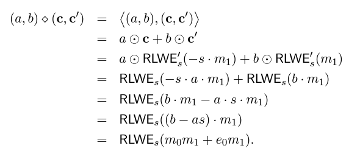

# GSW 介绍
GSW是公认的第一个第三代FHE方案。Craig Gentry, Amit Sahai 和 Brent Waters最先提出该方案，其成果发表在[CRYPTO13](https://eprint.iacr.org/2013/340)。GSW最主要的贡献是探索了一条新的构造同态乘法的路径。在第二代FHE方案中，同态乘法的噪声增加比同态加法要大的多。GSW提出新的构造可以更有效的控制同态乘法运算的噪声增长。作为代价，它的密文长度(矩阵形式)也要大的多。GSW方案是后续的FHEW方案和TFHE方案的基石。FHEW/TFHE正是借用GSW的同态乘法构造了新的bootstrapping算法。

## 预备知识
### RLWE 的基本结构和同态运算
首先，我们回顾RLWE(Learning With Errors over Rings)的代数构造。这里注意区别两个概念：加密(encrypt)和编码(encode)。 RLWE加密有如下形式：

  

这里,  是编码之后的明文(假定明文  , 编码则可以表示为  )； 是密钥。具体地，随机均匀地选取  ; 随机从离散高斯分布(均值为0，方差为  ) 选取  ; 随机从某个离散‘窄’分布选取密钥（比如  或  ）

相应地，给定一个RLWE密文  ，它的解密形式可以用下式表达

对进行解码(decode)恢复出最后的明文(前提条件是  )：

接着，我们回顾RLWE密文的同态加法操作。

类似地，可得同态标量乘法操作。

令  分析一下加法操作和标量乘操作的噪声增长如下:

注意到上面的标量乘操作要求d是一个较小的数，否则噪声增长超出允许的上界就会出现解密错误。显然，一个自然的问题是: 我们可不可以构造更好的标量乘操作使得对任何大小的d都适用呢？
为了解决该问题，我们定义一个新的LWE加密形式:

接着，对标量d进行基于B的扁平化操作 。令  , 定义新的标量乘法运算如下: 

容易发现，与旧的标量乘法操作  相比，新的标量乘法操作  拥有更好的噪声增长控制。

### GSW 密码方案
#### 直觉
基于上述的RLWE和RLWE'方法，我们现在介绍(R)GSW。直觉上讲， RGSW构造如下:

定义GSW乘法操作  如下

 

  
   

#### 正式的构造
上述的是GSW的直觉式构造方法，GSW论文给出的实际构造有一些不同。

#### RGSW的噪声增长分析

