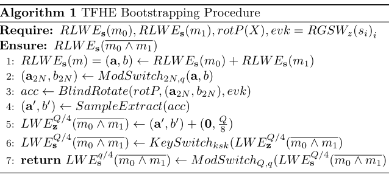

# TFHE方案介绍
这里介绍TFHE方案。它是对FHEW方案的拓展，特别是在改进GSW乘法和FHEW bootstrapping性能上做出了重要贡献。可以说TFHE是第三代FHE方案中性能最好的一个。

## 预备知识
### Torus 
Torus就是TFHE中T的由来。Torus定义成[0,1)的实数，他在正常的实数运算基础上需要mod 1,即取正常运算结构的小数部分，例如:
0.11+0.92=0.03， 10*0.11=0.1

在TFHE的软件实现中，实际上用的int32整型来表征Torus。换句话说，Torus事实上被当成 。

利用ModSwitch可以证明Torus结构和正常的 结构是等价的。所以这篇文章里避免提及Torus从而使得TFHE方案的表述更简洁。

### Cmux Gate
令 ，定义 如下：

 

 
也就是说,CMux的功能是，给定一个加密状态下的比特C，如果C是1，那么输出m1的密文，否则输出m0的密文。这里关键的是GSW乘法运算  （关于GSW乘法，可以参考我的这篇[博文](https://github.com/davidhoo1988/davidhu.github.io/blob/gh-pages/pages/GSW/main.md)

 
### Blind Rotation
基于上面对CMux的介绍，现在可以引入TFHE bootstrap最核心的运算Blind Rotation。

### Constant Extraction

## TFHE bootstrapping
### 基本原理
首先意识到  的根构成了阶数为2N的乘性循环群(cyclic multiplicative group) 。 TFHE bootstrapping的输入是一个LWE instance , 为了表述方便这里假定q=2N。引入一个新概念，即旋转多项式(rotation polynomial) ，初始化bootstrap的输入为 , 接着对acc(同态地)乘以 的密文（这个概念称之为blind rotation，在正式构造中再详细介绍）最终得到以下形式：

注意这里引入rotP的关键原因是：如果 ，那么多项式  的常数项一定是 ；如果 ，则它的常数项一定是 。如果我们可以同态地提取这个常数项，那么实际上就是同态地计算符号函数:

 

 
### 正式构造
这里我们以(同态)与非逻辑为例，正式介绍TFHE bootstrap。给定m0和m1的密文，经过bootstrap输出NAND(m0,m1)的密文，即：

首先,同态加法是容易做的，即。接下来的目标是同态地将 映射成 ，该映射可以用下面表格表示：

(a,b) | a+b  | NAND(a,b)
----  | ---- | ----
(0,0) | 0    | 1
(0,1) | 1    | 1
(1,0) | 1    | 1
(1,1) | 2    | 0

也就是说，bootstrap的难点是如何同态地把0映射成1，1映射成1，2映射成0。具体而言，需要达成下面三个目标。
   1.  舍入到最近的  的整数倍
   2. 映射规律：
   3. 映射之后得到的一比特信息缩放  倍（这是因为extraction最终得到 这样的形式，需要做一次Key-Switching和一次Modular-Switching 恢复成  ）

总而言之，函数f应当将区间  映射到 ； 映射到 。但这里存在一个问题：旋转多项式rotP必须满足负周期性f(v+q/2)=-f(v)，因此上述映射关系不能直接满足。解决方案是把  映射到 ， 映射到 ，这样得到  。最后加入无噪声的LWE密文  得到目标映射:
 

 

综上所述，TFHE需要的特定形式的旋转多项式  为： 

  

  

   

因此， ，否则 。
 
 但是，我们需要解决这样的问题，因为RLWE安全性的要求，需要rotP定义在一个更大的多项式环上，即
 最后，我们归纳TFHE bootstrap算法步骤如下：
   

  
   

   
### 噪声分析
bootstrap操作本身会引入额外噪声。为了保障TFHE bootstrap的正确性，一个关键的问题是分析bootstrap算法的噪声，使得噪声幅值大小在可控范围。
