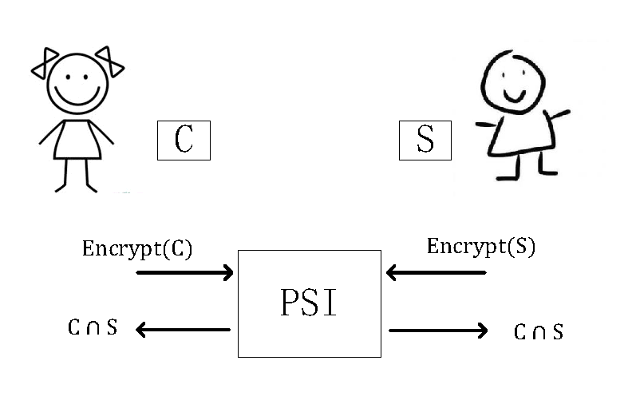
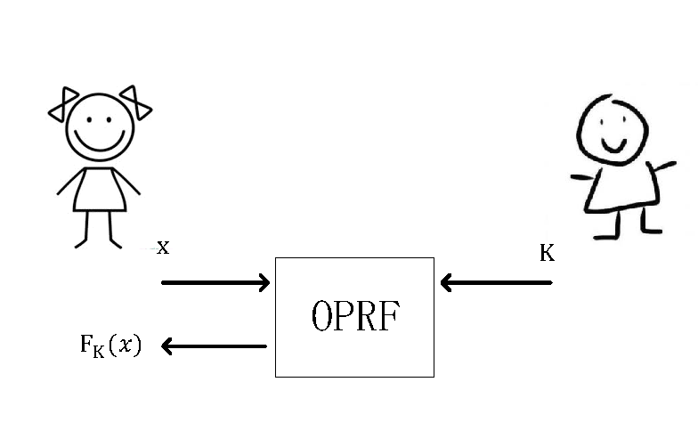
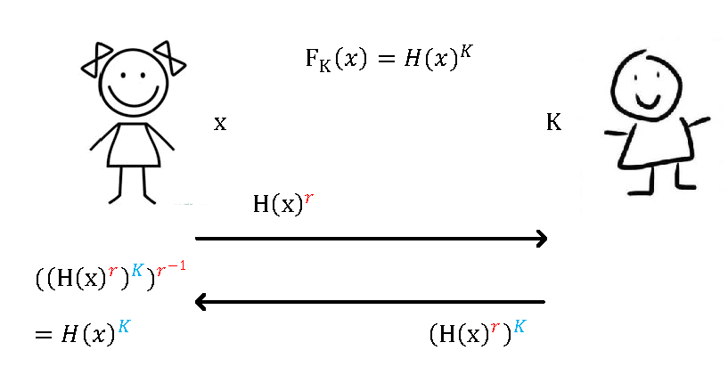
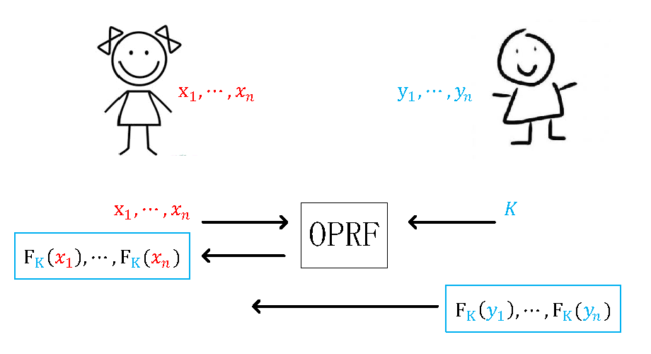

# 标准PSI
这里正式的描述什么是标准PSI。计算双方各种拥有集合，记为C和S。在PSI协议计算过程中，这些集合内部信息都不允许透露，计算结束后双方只知道集合交集部分，其他关于集合的信息一概不知道。该过程可以用下图表示：
   

  
   

   
  PSI的构造有很多，大致上可以分成DH-based, circuit-based, OT-based。 本篇文章介绍DH-based，也就是基于Diffie-Hellman假设的群结构。该方法首先于1986年被提出。我们按这里的[讲座视频](https://www.youtube.com/watch?v=1bkaE9RodeQ&ab_channel=TheBIUResearchCenteronAppliedCryptographyandCyberSecurity)来详细介绍这种方法。大致上，需要进行两步。首先需要基于DH构造OPRF(oblivious pseudo-random function); 接着利用OPRF最终构造PSI。
  
  ## Oblivious Pseudo-Random Function (OPRF) 
  我们知道PRF是伪随机函数，它的输出和真随机分布在多项式时间内不可区分；在此基础上引入OPRF。OPRF和PRF的主要区别是需要两方参与PRF的计算。Alice拥有函数的输入x, Bob拥有密钥K，Alice和Bob合作得到 ，但是Alice不会向Bob泄露自己的x，同样地，Bob也不会向Alice泄露自己的K。整个OPRF计算流程可以用下图表示：
   

  
   

   
  OPRF的具体实现途径很多，这里介绍一种基于Diffie-Hellman的经典构造。对于Alice的输入x，首先需要一个特别的哈希函数H将x编码到乘法群的一个元素，即 。为了不让Bob知道x， Alice生成一个随机数r，接着计算并发出 。注意Alice发出的  服从均匀分布，因此Bob得不到任何信息； Bob拿到  后计算 并返回给Alice。注意  实际上是一个PRF，因此  和均匀分布不可区分。最后Alice做一次r逆运算恢复出  。
上述过程可由下图表达。  
   

  
   
   
   
  ## 通过OPRF构造PSI
  理解了OPRF，PSI的构造就容易了。设定Alice的集合为  ， Bob的集合为  且拥有OPRF的密钥K。 Alice和Bob协作一次OPRF操作，最终Alice得到  ; 然后Bob直接做一次PRF操作，将结果  发送给Alice； 最终Alice比较  和  得出交集部分。下图整理了OPRF-based PSI整个计算过程。
   

  
   

   
   
   ## 通讯复杂度优化
   
   ## 代码实现
   
