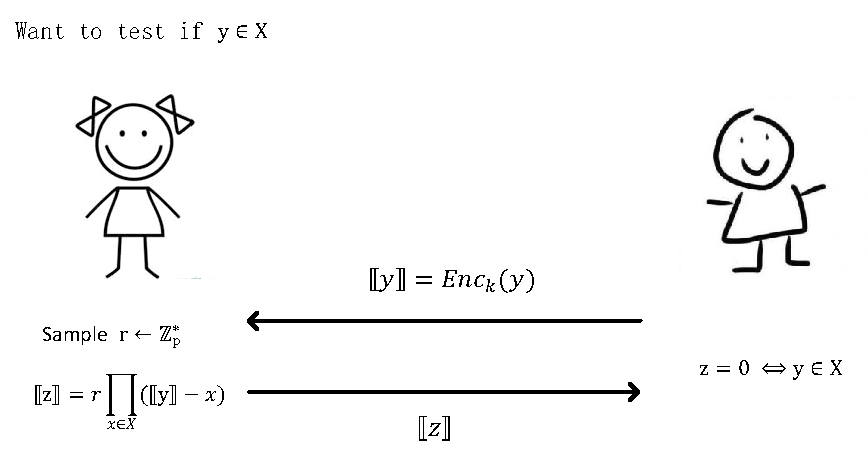
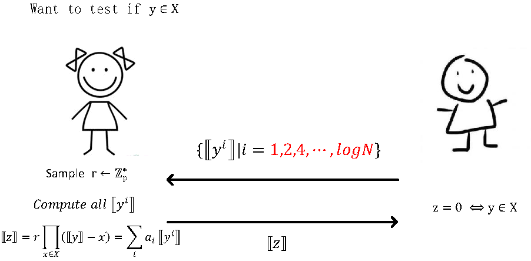

# 通过Oblivious Polynomial Evaluation 构造标准PSI
通过OPE实现PSI是一种重要方式。这里我们首先介绍OPE并给出基于FHE的OPE实现，最后利用OPE构造PSI。

## Oblivious Polynomial Evaluation (OPE)
### Membership Test
首先讨论如何利用OPE来解决Membership Test问题，即Client需要检测自己集合的元素  是否在Server的集合X中，除此之外Server和Client都不应探知任何其他信息。下图描述了整个方法：
  

  
  

  
  注意这里Bob得到的结果：如果 ，那么Bob得到0；如果 , 那么Bob得到一个随机数，因此不会泄露集合X内其他元素的信息。
  
 另一方面，上述方法最大的挑战是如何计算[z]。因为FHE支持的乘法次数总是有限的(为了保障FHE的运算速度足够快，在实际应用里常常不考虑使用bootstrap.。FHE乘法深度的典型值为6)，而计算[z]需要的乘法深度为  。如何优化[z]的乘法计算深度是核心问题。
 
 
 现在我们讨论如何解决它,即给定[y]，如何使用尽可能少的乘法深度算出 。
 
 方法一：给定唯一的[y]，计算  。按此方法，容易得出算乘法深度为  。
 
 方法二：给定所有的  。按此方法，可知无需做乘法即可算得[z], 其乘法深度为0。方法二的主要问题是通讯代价很大，需要  。
 
 方法三: 给定所有的2的幂次项，即  。容易推出计算[z]需要的计算深度为  ，通讯代价为  。
 
至此，我们利用方法三例化Private Membership Test, 如下图所示:

  

  
  

