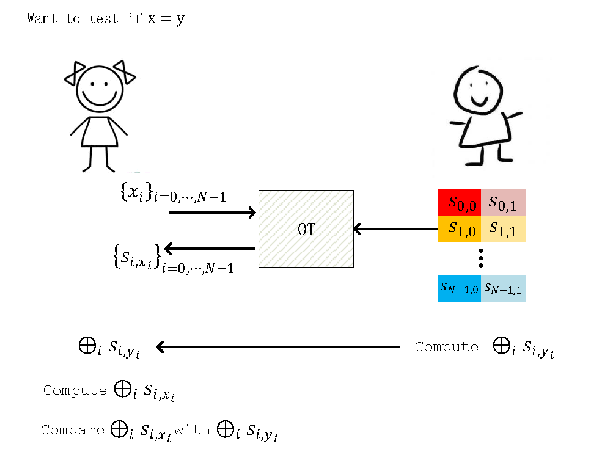

# 基于Oblivious Transfer构造PSI

## 预备知识 Oblivious Transfer
Oblivious Transfer (OT,透明传输) 是一种特殊的多方安全计算。OT设定存在计算双方Alice和Bob，Bob拥有2个字符串s1和s2。Bob需要“秘密”地传输其中一个字符串给Alice。

## (Oblivious) Equality Test
这里的问题是这样的：Alice有N-bit 字符串  ，Bob有N-bit 字符串 ，现在比较x是否等于y，但是不泄露x，y本身(也就是说，当x不等于y时，Alice不能获取关于y的任何信息，Bob也不能获得关于x的任何信息)。

利用OT我们可以这样构造Equality Test：Bob给自己私有字符串y的每一个比特分配两个随机数（每个随机数有  比特），分别对应‘0’和‘1’，记为  。接着Alice按照自己私有字符串x的比特数值为索引，和Bob进行N次1-out-of-2 OT，获得Bob手中的N个随机数，即  。最后Bob计算  并发送给Alice，Alice计算  并和  比较，如果两者相当，则说明  , 否则  。

下图描述了整个思路：
   

  
   

   
### Membership Test
