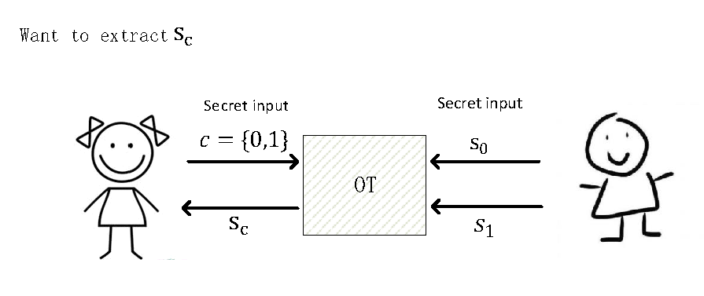

# 基于Oblivious Transfer构造PSI

## 预备知识 Oblivious Transfer
Oblivious Transfer (OT,透明传输) 是一种特殊的多方安全计算。OT设定存在计算双方Alice和Bob，Alice拥有一个选择比特  , Bob拥有2个字符串  和  。Bob需要根据Alice的选择比特  “秘密”地传输其中一个字符串，即  ， 给Alice。传输过程需要保证Alice只了解  而不了解  ；并且Bob不了解Alice拥有的  。

下图描述了整个思路：
   

  
   

   
## (Oblivious) Equality Test
这里的问题是这样的：Alice拥有N-bit 字符串  ，Bob有N-bit 字符串 ，现在比较x是否等于y，但是不泄露x，y本身(也就是说，当x不等于y时，Alice不能获取关于y的任何信息，Bob也不能获得关于x的任何信息)。

利用OT我们可以这样构造Equality Test：Bob给自己私有字符串y的每一个比特分配两个随机数（每个随机数有  比特），分别对应‘0’和‘1’，记为  。接着Alice按照自己私有字符串x的比特数值为索引，和Bob进行N次1-out-of-2 OT，获得Bob手中的N个随机数，即  。最后Bob计算  并发送给Alice，Alice计算  并和  比较，如果两者相当，则说明  , 否则  。

下图描述了整个思路：
   

  
   

   
## Membership Test
有了上述Equality Test的构造，容易进一步构造Membership Test: Alice拥有N-bit 字符串  ，Bob 拥有  个N-bit字符串  。现在要求判断  且不泄露  。

具体构造如下：
1. 对所有的  都做一遍Equality Test，这样共计做  次Equality Test。
2. 若发现这  次Equality Test出现元素相等的情况，说明  ； 否则说明  。

## Set Intersection
最后介绍求交运算 (Private Set Intersection)。这里设定Alice拥有集合 ， Bob拥有集合 ； 现在要求Alice和Bob协同计算  但不向对方泄露自己的集合。

利用上述Membership Test容易构造Private Set Intersection如下：
1. 对Alice的集合X中的每一个元素做一次Membership Test, 共计做n次Membership Test （等价于做  次Equality Test）。
2. n次Membership Test返回n次判断结果，即可得到Alice的集合X中从属集合Y中的元素，即  。

## 进一步优化
注意到上面描述的Private Set Intersection算法需要进行  次比较(Equality Test)。 如果集合很大时，比较数量是巨大的。那么问题来了，有没有可能减少PSI当中的比较次数呢？ 答案是利用哈希(Hashing)。

使用Hash，可以将比较次数降至  。

